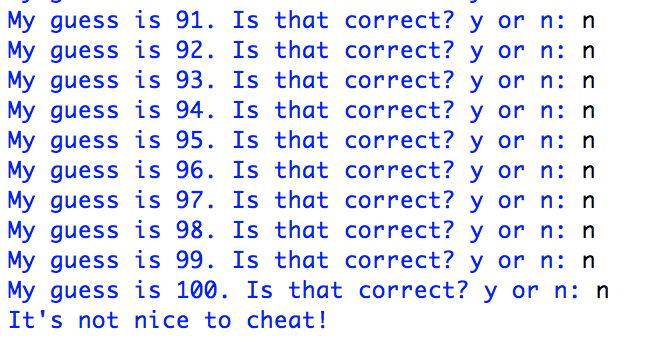

# Problem Set 5

### Due Monday, October 17, 2022, at 11:59pm EDT

For this problem set, you will submit to Canvas **a single .zip file**. Detailed instructions for what the .zip file should contain are at the end of this problem set. Note that if you do not submit the files as specified here, there will be a major deduction in your grade for this assignment. Following directions to the letter is a crucial skill for computer programming.

**Note: Your programs should all have the following format: import statements (if necessary); then function definitions (if there are any); then a `main()` function that gets the ball rolling and calls the functions you defined (if any); and finally outide all other functions, the call to `main()`.**

### Comments
I now expect you to write well-formatted and helpful comments in your code! Two points will be deducted if you provide no or minimal comments, and 1 point will be deducted if you have sufficient comments but they do not conform to these requirements:

* Before every function, describe what it does and what its arguments are (if any).
* Before every variable, explain what value it is holding or what purpose it serves. (Exception: the variable that helps you go through a `for` loop does not need to be explained, of course!)
* Do not write comments at the end of a line unless they are really short.
* If you have a long comment, insert some line breaks so it doesn't trail off end of the screen.
* Leave a new line before each comment so they are easy to read.

And, as always, in every program, the first four lines (comments) should be:

* The name of the file.
* Your name.
* The date.
* A statement saying "This code is my own work. I did not share my code or look at the code of another student."

---

## Part 1: Madlibs
In this program, you will write your own interface for doing [Madlibs](https://en.wikipedia.org/wiki/Mad_Libs). I've provided a few sample Madlibs. Look at the text file called `madlib2.txt`. You will see normal text interspersed with parts of speech in all caps. Here's an excerpt:

```
When I was VERB_IN_ING to PLACE , I found a NOUN on the sidewalk .
```

When you play Madlibs with friends with paper and pencil, only one person (the scribe) can see the text. The scribe asks the other players for words fitting the part of speech (e.g., noun, verb, place). Since the other players don't know what the text is about, they select whatever words come to mind that fit the part of speech. Once all the responses have been collected, the scribe reads the completed text out loud, and (in theory) hilarity ensues.

In this version of the game, the computer knows the text and asks the user for words. The computer then writes out the complete text to a file. 

Here are the requirements for this prorgram:

1. A function called `readMadLib(infile)`. This function takes as an argument a string that is the name a file. It opens the file, reads the whole file into a string, splits the string on space using `split()`, and returns the **list** that `split()` creates.

2. A void function called `writeMadLib(mylist, outfile)`. This function takes as its first argument a list, `mylist`, and writes it out to the file specified by the second argument, `outfile`.

3. A `main()` function. The main function should have the following functionality:

* Get a file name from the command line and pass it to `readMadLib()`. 
* Take the list returned by `readMadLib()`, and proceed through the list item by item. 
* Each time you come across an item that is all caps, ask the user for a word in that category. Replace that item in the list with the word the user provides. Note that there might be additional conditions to consider other than all caps! 
* Call `writeMadLib(mylist, outfile)` with the modified list and an output file name.

Here is a sample run of the program using `madlib2.txt` as the input file.


And here is what the output file looks like:

```
When I was swimming to Trader Joe's , I found a lampshade on the sidewalk . I picked it up and gave it to my fireplace who said " Meh !"
```

*Hint: Don't forget to consult the various functions on strings, which you can learn about [here](https://www.w3schools.com/python/python_ref_string.asp).*

*Feel free to entertain the TAs and me by providing your own Madlib!*

## Part 2: Guess my number, version 1
In the last problem set, you wrote a program in which the program randomly selected a letter of the alphabet and the user tried to guess it. This time, the tables will be turned: the computer will have to guess what the user is thinking. In addition, we'll switch from letters to integers between 1 and 100, inclusive.

The user will pick a number, and the computer will try to guess it. The user will not actually tell the computer anything other than "yes" or "no", so the computer has to have a strategy. In Part 2, the computer's strategy will be to start at 1, then keep guessing each subsequent number until the correct number is guessed.

You can decide how you would like to structure your program. These are the requirements:

1. Ask the user to think of a number between 1 and 100 inclusive.  

2. The computer will then try to guess the number by starting at 1, and then guessing each subsequent number until it guesses correctly. The computer will print out its guess to the user and ask the user to respond `y` if the guess is correct or `n` if the guess is incorrect. If the user enters anything other than `y` or `n`, the program will say that it didn't understand and ask the user to respond again with either `y` or `n`.

3. When the user enters `y`, the program will print out a thank-you message that mentions how many guesses it took and terminate. However, if the user never enters `y`, it means the user was cheating, and the program should print out a message reminding the user that it isn't nice to cheat.

4. The TAs and I should be able to run your program simply by going to to the `Run -> Run Module` option in IDLE.

 Here is an example successful run:


And here's an example where the user cheats. I've left out a bunch of guesses in the middle, of course!


```...```




## Part 3: Guess my number, version 2

In Part 3, you will write another version of the program in Part 2, but this time, the computer will guess a random integer between 1 and 100 rather than starting at 1 and going up one-by-one. You can [look here](https://www.w3schools.com/python/ref_random_randint.asp) to learn about how to choose a random integer using the `randint()` function of the `random` module

To guarantee that the computer will eventually guess the number, you will keep track of what it guesses with a list, and use that list to prevent the computer from guessing the same number twice. 

Other than how the computer guesses the number, the behavior should be the same as Part 2 (e.g., asking for `y` and `n`, reporting back the number of guesses or whether the person cheated). Again, you can structure this however you like, as long as it runs as intended, produces the correct output, is commented, and doesn't have a lot of unnecessary code.

Here is an example successful run:


## Part 4: List comprehensions, list slicing, and reading Python documentation

This program, `part4.py` will give you practice working with list comprehensions, list slicing, and reading Python documentation.

1. Write a function called `loopLists(n)` that takes an integer argument `n` and does the following: 

 * Using a **loop**, create a list `randlist` that contains `n` random integers between 1 and 100, inclusive. (Duplicates are fine!)
 * Using a **loop**, create a different list `evenlist` that contains only the even numbers from the list you created above.
 * Return `randlist` and `evenlist`

2. Write a function called `compLists(n)` that takes an integer argument `n` and does the following: 

 * Using a **list comprehension**, create a list, `randlist`, of `n` random integers between 1 and 100, inclusive. This means you create the list in a single line of code. For a review of list comprehensions, [see here](https://realpython.com/list-comprehension-python/#using-list-comprehensions).
 * Using a **list comprehension**, create a list, `evenlist`, that contains only the even numbers from the list you created above. Again, you must create the list in a single line of code!
 * Return `randlist` and `evenlist`

3. Write a function called  `loopaverage(mylist)` that **uses a loop** to calculate and return the average of all the numbers in a list.

4. Write a function called  `fastaverage(mylist)` that calculates and return the average of all the numbers in a list **in a single line without importing any additional libraries**. Have a look at [these useful built-in Python functions](https://docs.python.org/3/library/functions.html) if you need some ideas.

5. Write a `main()` method that:

* Call `loopLists(10000)`. Calculate and print out the average of the two returned lists using `loopaverage()`.
* Call `compLists(10000)`. Calculate and print out the average of the two returned lists using `fastaverage()`.
* Using either of the two averaging functions, calculate and print out the average of each half of each of the four returned lists. Use [list slicing](https://stackabuse.com/python-slice-notation-on-list/) to access the first half and the second half of each list. 


You will print out a total of 12 averages in the `main()` method. If all your averages are not close to each other (and to 50.5), go back and review your code! With lists of length 10,000, you should be getting close to the expected mean.

---

## What to turn in
If you haven't already, create a `ps5` folder. In your `p5` folder you should have three python scripts: `part1.py`, `part2.py`,  `part3.py`, and `part4.py`. Remove any other things you might have accidentally put in the folder, then zip the folder up using whatever means you normally use to zip things up (e.g., on a Mac, you can right click and select `Compress`). Do not zip up each python file individually. You should create a single zipped file, inside of which the four unzipped python files reside.

Upload the `.zip` file you created to Canvas. 

Note that if you do not submit the files as specified here, there will be a major deduction in your grade for this assignment. Following directions to the letter is a crucial skill for computer programming.

Remember that your comments need to be helpful **and** well formatted.

### This problem set is due Monday, October 17, 2022, at 11:59pm EDT.
